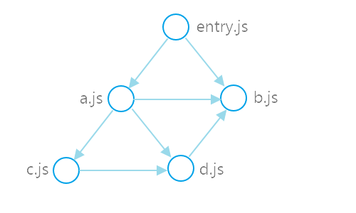
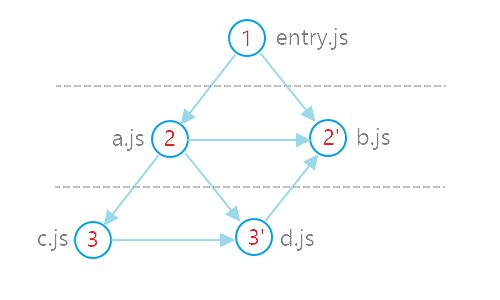

# deps-walker

[](https://travis-ci.org/sergei-startsev/deps-walker)
[](https://ci.appveyor.com/project/sergei-startsev/deps-walker/branch/master)

[Graph traversal](https://en.wikipedia.org/wiki/Graph_traversal) to walk through ES6/ES2015 module dependency graph for further static analysis. The traversal algorithm is classified as [Breadth-first search (BFS)](https://en.wikipedia.org/wiki/Breadth-first_search).

## Install

`$ npm install deps-walker`

## Usage

Here is an example of an entry point module `entry.js` with its dependencies, which in turn depend on their dependencies, which in turn depend on...

```js
//------ entry.js ------
import a from './a.js';
import b from './b.js';

//------ a.js ------
import b from './b.js';
import c from './c.js';
import d from './d.js';

//------ c.js ------
import d from './d.js';

//------ d.js ------
import b from './b.js';
```

In other words:

```
entry.js -> a.js
entry.js -> b.js
a.js -> b.js
a.js -> c.js
a.js -> d.js
c.js -> d.js
d.js -> b.js
```

<p align='center'>
  
</p>

`deps-walker` is used to traverse `entry.js` dependency graph:

```js
const walk = require('deps-walker')();

walk('entry.js', (err, data) => {
  if (err) {
    // catch any errors...
    return;
  }
  const { filePath, dependencies } = data;
  // analyse module dependencies
});
```

The dependencies are traversed in the following order:

<p align="center">
  
</p>

#### Async/await API

`deps-walker` support async/await API, it can be used to await traverse completion:

```js
async function traverse() {
  await walk('entry.js', (err, data) => {/*...*/});
  console.log('Traverse is completed');
}
```

#### Multiple entry points

`deps-walker` supports multiple roots:

```js
walk(['entry1.js', 'entry2.js', 'entry3.js'], (err, data) => {/*...*/});
```

### Parsers

`deps-walker` uses [babylon](https://github.com/babel/babel/tree/master/packages/babel-parser) parser with `sourceType: module` option by default, but you can customize any of [default options](https://github.com/babel/babel/tree/master/packages/babel-parser#options):

```js
const parse = require('deps-walker/lib/parsers/babylon');
const walk = require('deps-walker')({
  parse: (...args) =>
    parse(...args, {
      // options
      sourceType: module,
      plugins: ['jsx', 'flow']
    })
});

walk('entry.js', (err, data) => {});
```

or specify your own `parse` implementation:

```js
const walk = require('deps-walker')({
  parse: (code, filePath) => {
    // parse implementation
  }
});
```

### Resolvers

### Ignore

### Cache

## License

[MIT](https://opensource.org/licenses/MIT)
